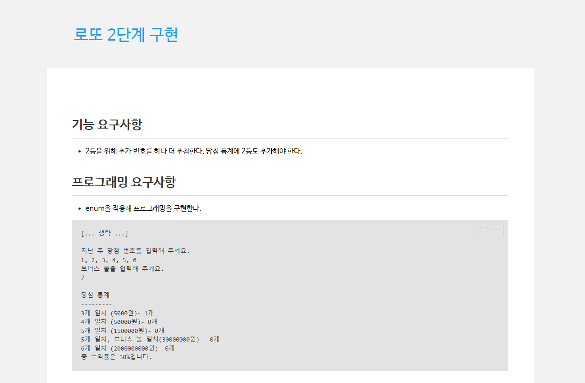
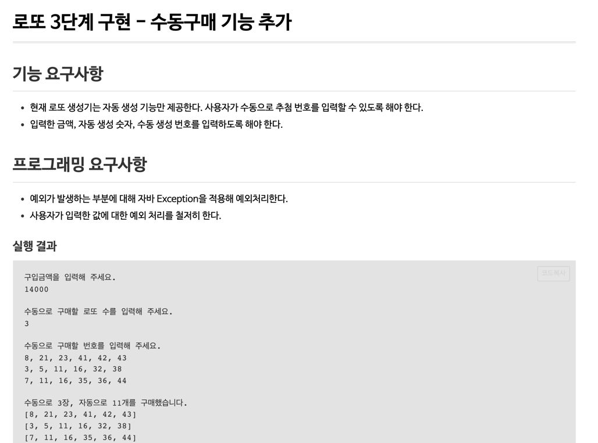

# be-w2-lotto
웹 백엔드 2주차 로또 구현

# step1

## 요구사항
- 로또 금액을 입력.
- 로또 금액에 따른 구입 수량만큼 로또 묶음 생성.
- 당첨 번호를 입력.
- 당첨 번호를 이용하여 로또 묶음에서 당첨 통계 출력.
- 총 수익률 출력.
- 

## 구현 내용.
- ConsoleInput 클래스 내 getLottoPurchaseMoney()에서 로또 금액을 입력
- LottoBundle에서 getCount() 함수를 통해 구입 금액을 1장의 가격으로 나누어 구매 할 수 있는 수량 계산.
- WinningStats 클래스에서 당첨 개수 및 수익률 관련 로직 구현.
  - getLottoCorrectCount() 함수를 생성하여 맞은 개수를 구함.
  - getLottoCorrectCountList() 함수에서 일치하는 개수별로 로또의 수량을 표시하는 리스트 생성.
  - getProfit() 함수에서 WINNING_PRICE와 로또 개수를 곱해 총 수량 생성.  
  - getProfitRatePercent() 함수를 통해 수익률을 백분위로 표시하여 반환.

# step2

## 요구사항
- 2등을 위해 추가번호를 하나 더 추첨.
- 당첨 통계에 2등 추가.
- enum을 적용하여 프로그래밍 구현.
- 

## 구현 내용.
- enum 클래스 WinningPrice를 WinningStats 클래스 내에 정의하여 사용.
- enum 클래스 내에 index,lottoCount 변수를 정의하여 수익률 계산 및 당첨 통계 출력시 사용.
- MVC 패턴에 맞추어 구조 변경
  - controller 클래스 및 DTO 클래스 생성.
  - 입출력을 담당하는 InputView, OutputView 생성.

# step3

## 요구사항
- 수동으로 로또 추첨 번호를 입력 할 수 있도록 생성.
- 입력한 금액, 자동 생성 숫자, 수동 생성 번호를 입력하도록 설정.
- 사용자가 입력한 값에 대한 예외 처리 로직 생성.
- 

## 구현내용
- List를 일급 컬랙션 객체로 수정.
- 수동으로 로또 번호를 입력받은 경우, Lotto 생성자에 String 을 넣어 생성.
- 예외 로직 생성 
  - 로또 금액의 배수로 금액을 입력하지 않은 경우 Exception 생성.
  - 수동 로또 구매 관련 Exception 생성
    - 로또 개수를 입력해야 할 떄 숫자가 아닌 다른 값을 넣은 경우 Exception 생성. 
    - 1~45 사이의 숫자를 입력하지 않은 경우 Exception 생성.
    - 6개의 숫자를 입력하지 않은 경우 Exception 생성.
    - 중복된 숫자를 입력한 경우 Exception 생성.