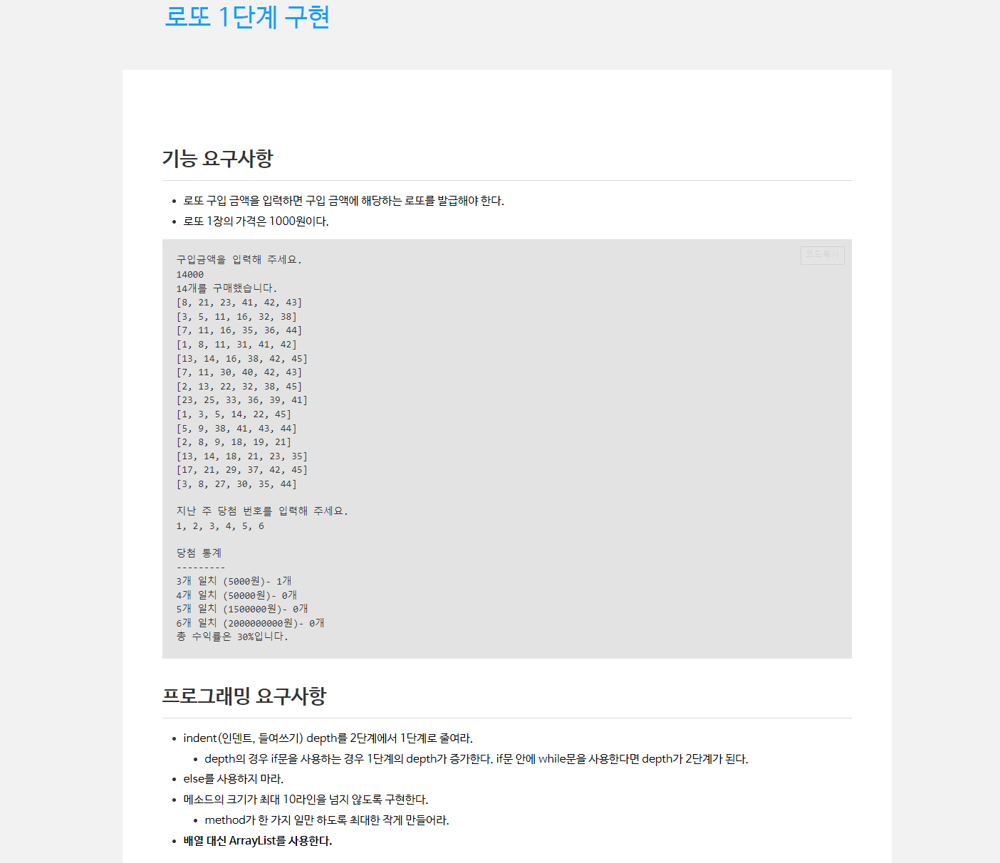

# be-w2-lotto
웹 백엔드 2주차 로또 구현

# step1

## 요구사항
- 로또 금액을 입력.
- 로또 금액에 따른 구입 수량만큼 로또 묶음 생성.
- 당첨 번호를 입력.
- 당첨 번호를 이용하여 로또 묶음에서 당첨 통계 출력.
- 총 수익률 출력.
- 

## 구현 내용.
- ConsoleInput 클래스 내 getLottoPurchaseMoney()에서 로또 금액을 입력
- LottoBundle에서 getCount() 함수를 통해 구입 금액을 1장의 가격으로 나누어 구매 할 수 있는 수량 계산.